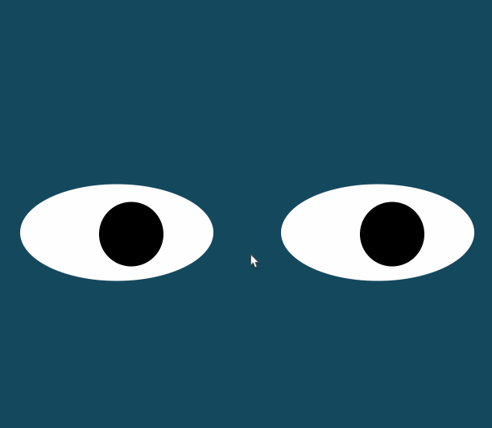

# Eyes (about)
In this project, I created eyes using CSS and made it follow the mouse curser. I was able to complete this project using .onmousemove function. I worked on one eye first and simply duplicated another to make it a pair.

## how to run
To run this program, you'll have to load the index.html files on your browser. Then, move your mouse cursor and see the eyes following your cursor.

## Things to improve in the future
I'd like to add a start button and buttons to change the style of the eyes, for example, make it look like cat's eyes or octopus's eyes, change the color, etc.

## License
MIT Professinal Certificate in Coding: Full Stack Development with MERN (2022)

online course
